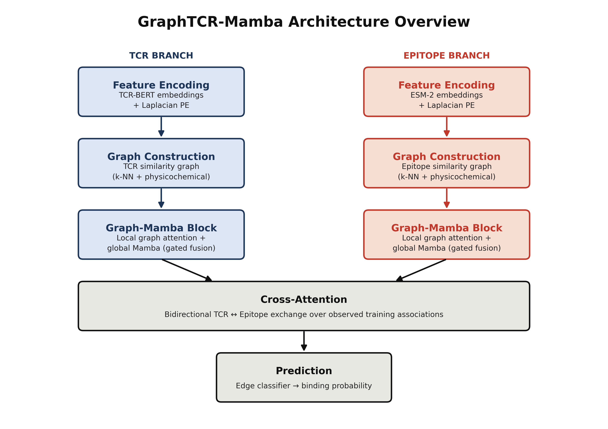
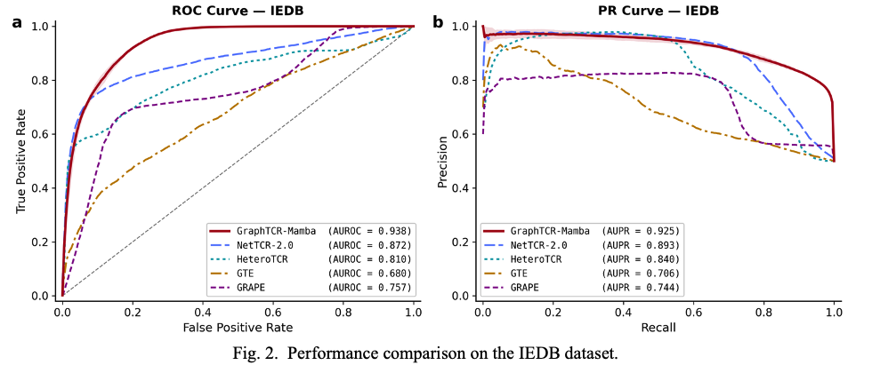

<div align="center">

# GraphTCR-Mamba


### Heterogeneous Graph Learning with Mamba for TCR-Epitope Binding Prediction

</div>

<br>

This repository holds the manuscript, results, and supporting materials for *GraphTCR-Mamba*, a heterogeneous graph framework for predicting T-cell receptor (TCR) to epitope binding. The work was completed during the summer of 2026 in the Department of Computer Science and Mathematics at Algoma University, and has been submitted to PSB for peer review.

Ellison Naz and Adam Fan developed the project under the supervision of Dr. Ping Luo, with contributions from Wenjun Lin. Corresponding author: Ping Luo, ping.luo@algomau.ca.

<br>

## Contents

- [The Problem](#the-problem)
- [Architecture](#architecture)
- [Results at a Glance](#results-at-a-glance)
- [Repository Structure](#repository-structure)
- [Related Repository](#related-repository)
- [Citation](#citation)
- [Acknowledgements](#acknowledgements)

<br>

## The Problem

T-cell receptors recognize peptide epitopes as part of adaptive immunity, but experimentally validating which TCRs bind which epitopes is slow and expensive. Only a small fraction of the possible interaction space has ever been characterized in the lab. Computational models fill that gap by learning from known interactions to prioritize candidates worth testing.

Most existing methods treat each TCR-epitope pair in isolation, missing out on relational signal between sequences that behave similarly. GraphTCR-Mamba takes a different approach: it builds a heterogeneous graph over TCRs and epitopes, connects sequences by similarity, and layers in a Mamba selective state-space branch so information can propagate efficiently across the whole graph rather than pair by pair.

<br>

## Architecture

<div align="center">

</div>

TCR and epitope sequences are processed through parallel, domain-specific branches, pretrained language model embeddings augmented with Laplacian positional encodings, followed by similarity-graph construction and stacked Graph-Mamba blocks. The two branches then exchange information through bidirectional cross-attention before a final classifier scores each candidate pair.

<br>

## Results at a Glance

<div align="center">

| Dataset | AUROC | AUPR |
|:---:|:---:|:---:|
| **IEDB** | 0.938 | 0.925 |
| **McPAS-TCR** | 0.943 | 0.947 |
| **VDJdb** | 0.993 | 0.992 |

</div>

<div align="center">

</div>

> Cold-start evaluation showed the model generalizes well to previously unseen TCRs, but performance declines when epitopes, or both interaction partners, are unseen. That gap between random pair-level and cold-start performance is one of the central findings of the paper.

Full cold-split and ablation results are available in [`tables/`](tables/).

<br>

## Repository Structure

    GraphTCR-Mamba-Manuscript/
    ├── manuscript/     Final draft submitted to PSB
    ├── figures/        Architecture diagram and ROC/PR comparison charts
    ├── tables/         Cold-split and ablation results as CSV
    └── references/     Citation file in BibTeX format

<br>

## Related Repository

The model implementation and training code are maintained separately at [GraphTCR-Mamba](https://github.com/GenTensor/GraphTCR-Mamba).

<br>

## Citation

```bibtex
@article{naz2026graphtcrmamba,
  author  = {Naz, Ellison and Fan, Adam and Lin, Wenjun and Luo, Ping},
  title   = {GraphTCR-Mamba: heterogeneous graph learning with Mamba for TCR-epitope binding prediction},
  journal = {Submitted to PSB},
  year    = {2026}
}
```

<br>

## Acknowledgements

This work is supported by the Algoma University Research Fund. Thank you to Dr. Ping Luo for the guidance and mentorship throughout this project.

<div align="center">

*Keywords: T cell receptor · heterogeneous graph · TCR-epitope prediction · Mamba · Laplacian positional encoding*

</div>
